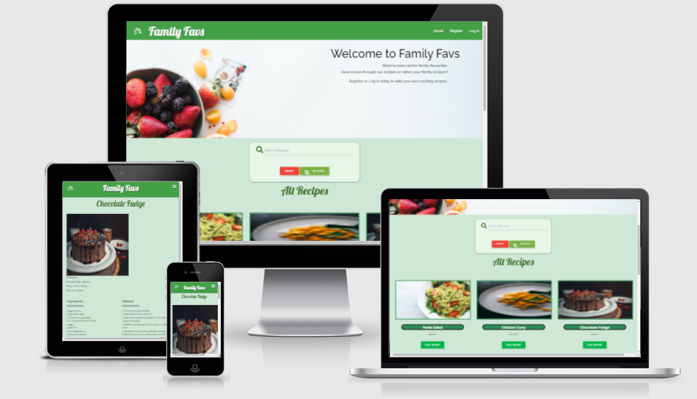

# Milestone Project 3 - Family Favs

### Click here for a link to the live project on GitHub [Family Favs](https://leah1977.github.io/FamilyFavs/)

A Data-Centric Development Project for Milestone 3.
  
The project is a web applications based on the creation of a recipe book.  It allows users to Create, Read, Update and Delete Recipes.

## Table of Contents.

1. [Introduction](#introduction)

2. [UX](#ux)

 - [Project-Goals](#project-goals)

 - [Strategy](#strategy)

 - [Scope](#scope)

 - [Skeleton](#skeleton)

 - [Features](#features)

 - [Design](#design)

3. [Project-Display](#project-display)

4. [Technologies](#technologies)

5. [Testing](#testing)

6. [Debugging](#testing)

7. [Deployment](#deployment)

8. [Acknowledgements](#acknowledgements)

  
## Introduction

## Welcome!

### This site was built using [GitHub Pages](https://pages.github.com/)/ and [Heroku](https://heroku.com)

I have created a mobile-first project.

# Family Favs

This is a data-centric web application.  I created this app to allow friends and family to grow and share family favourite recipes.  Each user can register and log in to add new recipes, edit old recipes, read others recipes and delete recipes they no longer wish to share.

There is also an admin user.  The admin user will have the permission required to create a new category.
  
### What value does it provide to its users.

This app encourages friends and family connectivity through a love of cooking.

It provides a valuable resource for children to learn and create family recipes.

### What value does it provide to the site owner.

This web application will provide the site owner with a valuable database of recipes to share with other family and friends.

The app can be enjoyed by all aspiring family cooks.

### Here is a demonstrating of how my web app looks on different screen sizes using [Am I Responsive Website](http://ami.responsivedesign.is/)

 

The app will resize according to the different screen sizes.

---

#### This project will include four separate pages. 

* Home page.

* Registration Form

* Sign in Form

* Recipe page

* 404 page, which has a link back to the home page without using browser navigation.

## Home page

The home page is made up of the title “Family Favs”.

There is a drop-down, select menu to the right, which expands to show a list of options

There is a footer on the home page.  This displays social links and a sign up to our newsletter option.  

## Registration Form

There is a registration form where users can fill out their information, to allow them to login and create, read, update or delete recipes. 

  
## Log In Form.

There will be a log in Form where registered users can fill in their user name and password to access further options to create, read, update or delete recipes.  

## Sign up Form

This page will allow the player to sign up for further information on updates for our web application.

The sign-up form is to register with our site to be notifie of updates.

### Features left to implement

# UX

## Skeleton:

### I have used Balsamique to draw up 3-page wireframes for Mobile, iPad and Desktop.
 
### Click here for a link to the Wireframes [Balsamique FamilyFavs](static/images/Wireframes.pdf)

## Project Goals.

  
### This project provides an back-end user centric web application.  It is intended to provide a space where family and friends can share recipes.

* To allow the user to create their own recipes.

* To allow the user to edit previously added recipes.

* To allow the user to delete previously added recipes.

## Strategy

### This website is for users looking to create and share recipes.

* I want to provide an application for users to search for recipes and add their own.

* I want the site to be intuitive.

* I want the user to navigate the site with ease.

## User Story 1

  
### What I expect to find on a recipe app?

1. I expect to be able to navigate around the app with ease.

2. I expect to be able to search for recipes.

3. I would expect the app to be visually appealing.

5. I would like to be able to add my own recipes.

## User Story 2

  As a website user, I want the app to be easy to use.  I would expect to be able to register and for my details to be secure and safe.

### What I expect to find on a web application?

  

1. Can I view all recipes?

2. Can I create my own recipes?

3. Can I edit or delete my own recipes?

  

## User Story 3

### Would this game be suitable for younger family members?

  

1. Is the website suitable for all family members?

2. Is it easy to navigate?

3. What age is the app intended for?

  

As a user, I would like to be able to add my own recipes and notes for viewing.
  
## User Story 4

### Would this app be suitable for sharing recipes?

  

1. Is the app easy to navigate?

2. Are there educational advantages to this app?

  

As a user, I would like to play to share my recipes with all family members and friends.

  

As a first time user I would expect

  

•   A registration option.

•   A log in option.

•   Good Graphics

•   An example of recipes already available.

•   A search option
  

As a returning user I would expect 

  

•   A log in option to create a user profile. 

•   My profile page to be private for my use.

•  Updated content.

  

As a designer I would expect

  

•   All buttons to be working

•   All links to be active

•   To be able to navigate through the site with ease

•   To have a 404 page to return users to the home page.

•   Striking colors to engage the user

•   To be able to add or delete categories.
  

Ideas -  have a gallery to put up tried and tested recipes.

  

With these user stories in mind, I put together some wireframes.  I included all the primary requirements and issues that were raised from my user story research.

## Scope

### Essentials will include

  

* Create Recipe function

* Edit Recipe function

* Delete Recipe function

## Features

#### This project will include four separate pages to be available to all users.

* Home page
* Recipes page
* Registration Form
* Sign In Form

#### This project will include five separate pages to be available to all registered and loggin in users only.

* Home page
* Profile page
* Create Recipes page
* Edit Recipes page
* Log out option

#### This project will include a further option for the admin user only.

* Home page
* Profile page
* Manage Categories
* Create Recipes page
* Edit Recipes page
* Log out option

  

## Color Scheme

### I will use the colours in the main body, header and footer

My primary colours will be green and yellow.  I will use variations of this colour to add designs that stand out and appeal to the user.

I used [Coolers](http://www.coolers.co) to generate my colours for the project. I then used variations within the project.

## Typography

### I will use the following fonts throughout the website for consistency in style.

* Eczar

* Rubik

  

I chose this for the main app title.

* Sans Serif as a back up

## Additional Features

  
## Project display

This project is responsive to appear on different screen sizes.

The display changes to accommodate smaller screen sizes. 

This project is specifically designed to engage with the user. We are encouraging the user to interact with recipe app.

This project will have specific responses depending on the users’ decisions and engagement.

There will be the main navigation system and structured layout.

  
## Languages

  

* [HTML](http://wwww.html.com) Used for all four HTML pages as the main markup language for this project.

* [CSS](http://www.css-tricks.com) Used to style the content of my website.

* [JavaScript](http://www.javascript.com).

## Technologies
 

In this project, I used the following to help build my website.
  

* [Font Awesome](https://stackpath.bootstrapcdn.com/font-awesome/4.7.0/css/font-awesome.min.css) for all the great icons.

* [Google Fonts](https://fonts.googleapis.com/css2?)

* [Balsamique](https://balsamiq.com/)

* [hover.css](https://cdnjs.cloudflare.com/ajax/libs/hover.css/2.1.1/css/hover-min.css).

* [html](www.html.com)

* [css] (www.css.co)

* [JavaScript](www.javascript.com)

---
## In this project, I used the following to help build my website.

  

Code used throughout this project was learned and implemented from the [Code Institute Diploma Programme](https://codeinstitue.net)
  

### [Font Awesome](https://stackpath.bootstrapcdn.com/font-awesome/5.1.3.0/css/font-awesome.min.css) for its excellent choice of icons.

### [Google Fonts](https://fonts.googleapis.com/css2?)

### Images

  

Images for this app were located in the clipart-library

  

[Card Images](http://clipart-library.com/lime.html)

  http://clipart-library.com/clip-art/50-504289_broken-egg-png-clip-art-egg-clipart-transparent.htm

http://clipart-library.com/images_k/eggs-transparent-background/eggs-transparent-background-5.jpg
  

Lemon and Lime Logo/Card Picture made with [Canva](www.canva.com)

  

logo.png

Cover photo

Photo by [Brooke Lark](https://unsplash.com/@brookelark?utm_source=unsplash&utm_medium=referral&utm_content=creditCopyText) on [Unsplash](https://unsplash.com/s/photos/cookbook?utm_source=unsplash&utm_medium=referral&utm_content=creditCopyText)

  
pasta salad
Photo by [Eaters Collective](https://unsplash.com/@eaterscollective?utm_source=unsplash&utm_medium=referral&utm_content=creditCopyText) on [Unsplash](https://unsplash.com/s/photos/pasta-salad?utm_source=unsplash&utm_medium=referral&utm_content=creditCopyText)

 chicken curry
  Photo by [Charles Deluvio](https://unsplash.com/@charlesdeluvio?utm_source=unsplash&utm_medium=referral&utm_content=creditCopyText) on [Unsplash](https://unsplash.com/s/photos/chicken-curry?utm_source=unsplash&utm_medium=referral&utm_content=creditCopyText)
 
  
 chocolate cake
 Photo by [Charles Deluvio](https://unsplash.com/@charlesdeluvio?utm_source=unsplash&utm_medium=referral&utm_content=creditCopyText) on [Unsplash](https://unsplash.com/s/photos/chocolate-cake?utm_source=unsplash&utm_medium=referral&utm_content=creditCopyText)
 
 Beef Stew
 Photo by [Charles Deluvio](https://unsplash.com/@charlesdeluvio?utm_source=unsplash&utm_medium=referral&utm_content=creditCopyText) on [Unsplash](https://unsplash.com/s/photos/beef-stew?utm_source=unsplash&utm_medium=referral&utm_content=creditCopyText)
 
 Meringue Roulade
 https://images.unsplash.com/photo-1505976378723-9726b54e9bb9?ixid=MnwxMjA3fDB8MHxwaG90by1wYWdlfHx8fGVufDB8fHx8&ixlib=rb-1.2.1&auto=format&fit=crop&w=634&q=80
 
## Further References

- Confident Coding by Rob Percival

- Confident Web design by Kenny Wood

- Patreon 

- [YouTube](https://www.youtube.com/) 

- [W3Schools](https://www.w3schools.com/) used for information to help in css styling

- [AmIResponsive](http://ami.responsivedesign.is/)

## Testing

[Testing Section](TESTING.md)

## Deployment
  
I used the programme [Gitpod](www.gitpod.io) in the development of this project.  I pushed it to GitHub using the CLI, which is built into Gitpod.
  
### To deploy this project to GitHub from its Gitpod repository - please follow these steps.

  
## Deployment

This project was deployed to Heroku with the following steps:

1.  Ensure your app has debug mode set to False when deploying.

2.  Add a file called Procfile with no extension to your project directory and add web: python app.py

3.  Heroku can install dependencies from a requirements.txt or a Pipfile

4.  To create a requirements.txt run pip freeze > requirements.txt

5.  To create a Pipfile run pip install pipenv, pipenv install

6.  Create an account on Heroku and create a new app.

7.  In your app dashboard, in the deploy section, select 'Connect to GitHub'

8.  Select the GitHub repository that contains your project.

9.  Select Automatic deploys and choose your desired branch.

10. Go to the app settings on Heroku and click 'Reveal Config Vars'

11. Add the required keys as they are in your local env.py (i.e IP, PORT, SECRET_KEY, MONGO_URI, MONGO_DBNAME)

12. Go to the app Overview page and when the build is finished, click 'Open App'

  
### To clone this project into Gitpod, you should follow these steps.

  
1. Open your Github account or create one.

2. Use the Chrome browser.

3. Install the extension for Gitpod.

4. Log into your gitpod account.

5. Navigate to the Project GitHub repository.

6. Under the Repository Family_Favs, click download.

7. This will trigger a new gitpod workspace that you can work on.

### Acknowledgements

  
Much thanks to my mentor Nishant Kumar for giving great support and encouragement throughout my third Milestone Project.

Much thanks to Code Institute Tutors for pointing me in the right direction when I was going off course.

Thanks also to support from the Slack Community. 

Thanks also to my husband and family for supporting me through this project and providing invaluable feedback.

### End of README

[Return to Table of Contents](#table-of-contents)
