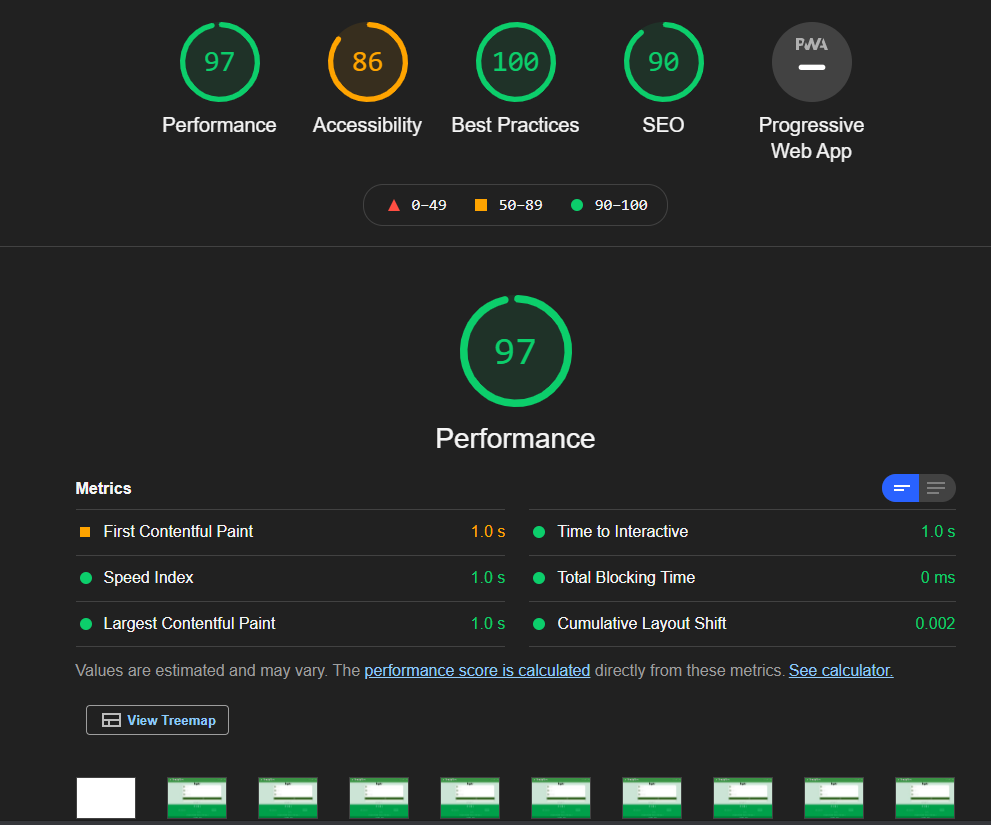

# Testing Of Milestone Project 3

## Table of Contents.

1.  [CSS Validation](#css-validator)
2.  [HTML Validation](#html-validator)
3.  [JS Validation](#js-validator)
4.  [Wireframe Comparison](#wireframe)
5.  [Lighthouse](#lighthouse)
6.  [Mobile](#mobile-testing)
7.  [Project Testing](#deployed-testing)
    - [Links](#links)
    - [Overlay](#overlay)
    - [Modal](#modal)
    - [Sign-up Form](#form)
8.  [User Stories](#user-stories)
    - [User Story 1](#user-story-1)
    - [User Story 2](#user-story-2)
    - [User Story 3](#user-story-3)
    - [User Story 4](#user-story-4)
9.  [Debugging](#debugging)

[Back to README.md](README.md)

## CSS Validator

Tested on W3C CSS Validator

    

[CSS Validation for https://family-favs-project.herokuapp.com/]

## HTML Validator

Pass code throught HTML Validator
[CSS Validation for https://family-favs-project.herokuapp.com/]

## JS Validator

Tested the site with jshint.com validator.

## Wireframe Comparison

* recipe profile page
* main page 

## Lighthouse

Tested the site using Lighthouse 

## Mobile

Tested the site for mobile-friendly usage

[Mobile-Friendly Test-Google Services](https://search.google.com/test/mobile-friendly)
![Mobile friendly approved](assets/images/

## Project Testing

### Links

Tested all links on all pages. All links work as intended. This allows the user to move from one page to another with ease.

**Testing**

I clicked on the drop-down menu.
I clicked on each option.

**Result**

When you click on  Home, you are returned to the home page.
When you click on Register, you are redirected to the registration page.
When you click on Log In, you are redirected to a Log In page.

**Expected**
The links work as expected.

**Expected**

Tested the social contact links in the footer

Tested the social contact links on all pages. When you click on a social link, the button will redirect you to the relevant page in a new window.

**Expected**

When you hover over the social link, it is expected that the link will change colour. When you click on the social link, you will be redirected to the relevant page in a new window.

**Testing**

Tested the social link on each page by clicking on the social links.

**Result**

The site acted as expected, and the link redirects you to a new page when you click on it.

**Fix**

No fix required.

### Tested the modal

**Expected**

**Testing**

**Result**

**Fix**

### Sign-up Form

Tested the form. Entered in details to each relevant section.
I checked the submit button by clicking on it.

**Expected**

**Testing**

Tested the form by filling out details for all sections.

**Result**

Testing across various devices

- Ensured the website was responsive on all pages through [Google Mobile Friendly](https://search.google.com/test/mobile-friendly)

- Ensured the website was responsive on different mobiles using [BrowserStack](https://www.browserstack.com/)

- Testing was also performed on Safari and Chrome

Several family members also carried out-Testing.

## User Stories

Implement the user stories.

### User Story 1

### What I expect to find on a recipe app?

1. I expect to be able to navigate around the app with ease.

User is able to navigate from page to page by clicking on links and buttons.

2. I expect to be able to search for recipes.

User can search for items on the home page by entering the item in the search bar.

3. I would expect the app to be visually appealing.

I have used light colours, mainly green and yellow to give a fresh and appealing look to the website.

5. I would like to be able to add my own recipes.

Users can add their own recipes, once they have registered and logged in.

[Add Recipe](static/images/readme_images/create_recipe.png)

### User Story 2

  As a website user, I want the app to be easy to use.  I would expect to be able to register and for my details to be secure and safe.

### What I expect to find on a web application?

  

1. Can I view all recipes?

2. Can I create my own recipes?

3. Can I edit or delete my own recipes?

  

### User Story 3

### Would this game be suitable for younger family members?

  

1. Is the website suitable for all family members?

2. Is it easy to navigate?

3. What age is the app intended for?

  

As a user, I would like to be able to add my own recipes and notes for viewing.
  
### User Story 4

### Would this app be suitable for sharing recipes?

  

1. Is the app easy to navigate?

2. Are there educational advantages to this app?

  

As a user, I would like to play to share my recipes with all family members and friends.

## Debugging

## End of Testing Section

[Return to Table of Contents](#table-of-contents)