# Testing Of Milestone Project 3

## Table of Contents.

1.  [CSS Validation](#css-validator)
2.  [HTML Validation](#html-validator)
3.  [JS Validation](#js-validator)
4.  [Wireframe Comparison](#wireframe)
5.  [Lighthouse](#lighthouse)
6.  [Mobile](#mobile-testing)
7.  [Project Testing](#deployed-testing)
    - [Links](#links)
    - [Overlay](#overlay)
    - [Modal](#modal)
    - [Sign-up Form](#form)
8.  [User Stories](#user-stories)
    - [User Story 1](#user-story-1)
    - [User Story 2](#user-story-2)
    - [User Story 3](#user-story-3)
    - [User Story 4](#user-story-4)
9.  [Debugging](#debugging)

[Back to README.md](README.md)

## CSS Validator

Tested on W3C CSS Validator
[CSS Validation for https://family-favs-project.herokuapp.com/](https://jigsaw.w3.org/css-validator/validator)
<p>
    <a href="http://jigsaw.w3.org/css-validator/check/referer">
        
    </a>
</p>


## HTML Validator

Pass code through HTML Validator
[CSS Validation for https://family-favs-project.herokuapp.com/]

[http://family-favs-project.herokuapp.com/get_recipes](https://validator.w3.org/nu/?doc=http%3A%2F%2Ffamily-favs-project.herokuapp.com%2Fget_recipes)
[https://family-favs-project.herokuapp.com/register](https://validator.w3.org/nu/?doc=http%3A%2F%2Ffamily-favs-project.herokuapp.com%2Fregister)
[https://family-favs-project.herokuapp.com/login](https://validator.w3.org/nu/?doc=http%3A%2F%2Ffamily-favs-project.herokuapp.com%2Flogin)
[https://family-favs-project.herokuapp.com/create_recipe](https://validator.w3.org/nu/?doc=http%3A%2F%2Ffamily-favs-project.herokuapp.com%2Fcreate_recipe)
[http://family-favs-project.herokuapp.com/get_categories](https://validator.w3.org/nu/?doc=http%3A%2F%2Ffamily-favs-project.herokuapp.com%2Fget_categories)

## JS Validator

Tested the site with jshint.com validator.

## Wireframe Comparison

Comparing the deployed version against the development version(wireframes)

* recipe profile page
* main page 

I decided not to open the recipes on a separate page on the main page but to include them on the home page.
I thought this would look better visually.

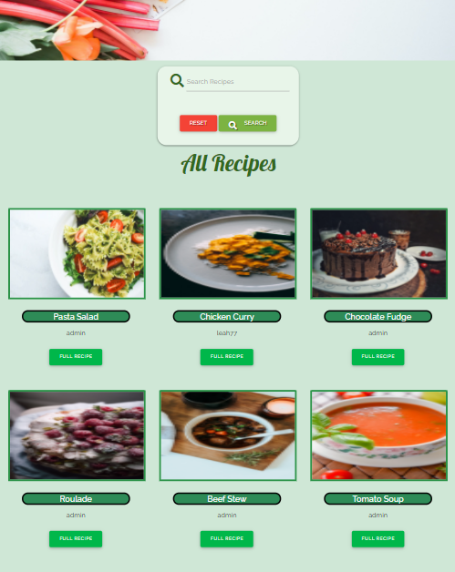

This then changed the layout of the navbar slightly by removing the recipes link.


* Registration

I changed the layout of this slightly.

Instead of separating First Names and Second Names, I let the user create a user name.

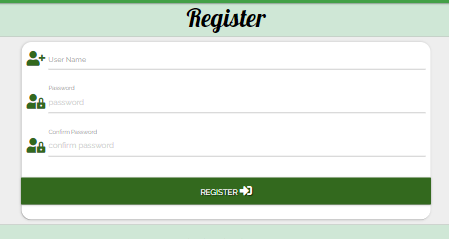

I also omitted the email as it was not required to register.

* Create recipe

For the create recipe section.

I kept this layout similar but omitted a difficulty level.

I want to add this as an additional feature at a later stage.

## Lighthouse

Tested the site using Lighthouse 

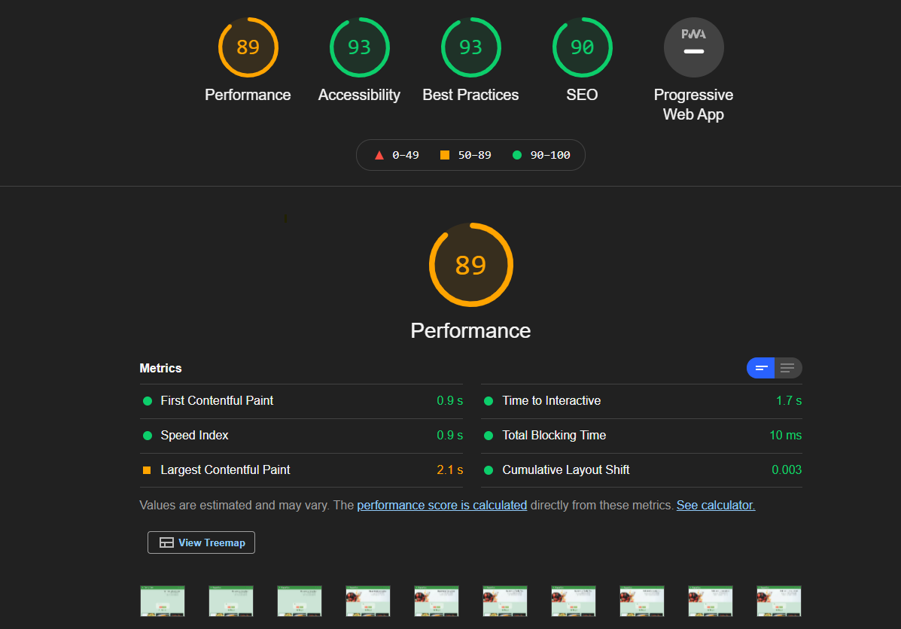

## Mobile

Tested the site for mobile-friendly usage

[https://search.google.com/test/mobile-friendly](https://search.google.com/test/mobile-friendly?id=10B7YLqttRT7af4Ml0gyCA)

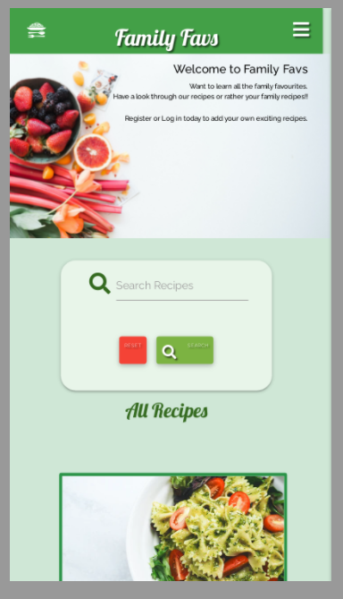

## Project Testing

### Links

I have tested all links on all pages. All links work as intended. This allows the user to move from one page to another with ease.


**Testing**

I clicked on the drop-down menu.
I clicked on each option.

**Result**

When you click on  Home, you are returned to the home page.
When you click on Register, you are redirected to the registration page.
When you click on Log In, you are redirected to a Log In page.

**Expected**
The links work as expected.


**Expected**

Tested the social contact links in the footer

I have tested the social contact links on all pages. When you click on a social link, the button will redirect you to the relevant page in a new window.

**Expected**

When you click on the social link, you will be redirected to the relevant page in a new window.

**Testing**

Tested the social link on each page by clicking on the social links.

**Result**

The site acted as expected, and the link redirects you to a new page when you click on it.


### Tested the modal


**Expected**


**Testing**


**Result**


**Fix**


### Registration Form

Tested the form. Entered in details to each relevant section.
I checked that the validation was working by entering invalid data.
The errors were displayed as expected.

I checked the registration button by clicking on it.
A pop-up message flashed up to confirm registration.

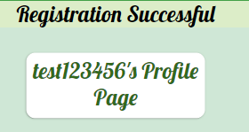


### Login Form

Tested the form by filling out details for all sections.

**Result**

The form worked as expected.

## Testing across various devices

- Ensured the website was responsive on all pages through [Google Mobile Friendly](https://search.google.com/test/mobile-friendly)

- Ensured the website was responsive on different mobiles using [BrowserStack](https://www.browserstack.com/)

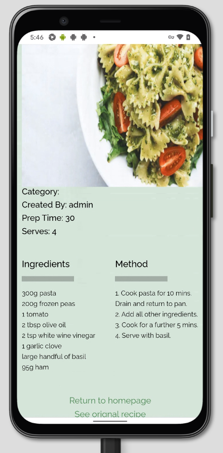

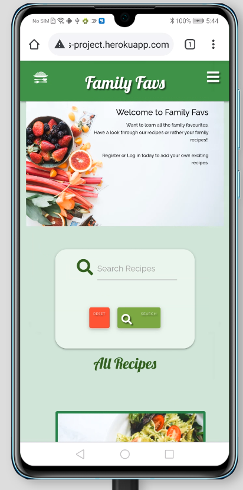


- Testing was also performed on Safari and Chrome

Several family members also carried out-Testing on iPhone 10 and SamsungA51.

Also, devices tested well.

## User Stories

Implement the user stories.

### User Story 1

### What do I expect to find on a recipe app?

1. I expect to be able to navigate around the app with ease.

The user can navigate from page to page by clicking on links and buttons.

2. I expect to be able to search for recipes.

Users can search for items on the home page by entering the item in the search bar.

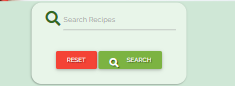

3. I would expect the app to be visually appealing.

I have used light colours, mainly green and yellow, to give the website a fresh and appealing look.

5. I would like to be able to add my recipes.

Users can add their recipes once they have registered and logged in.

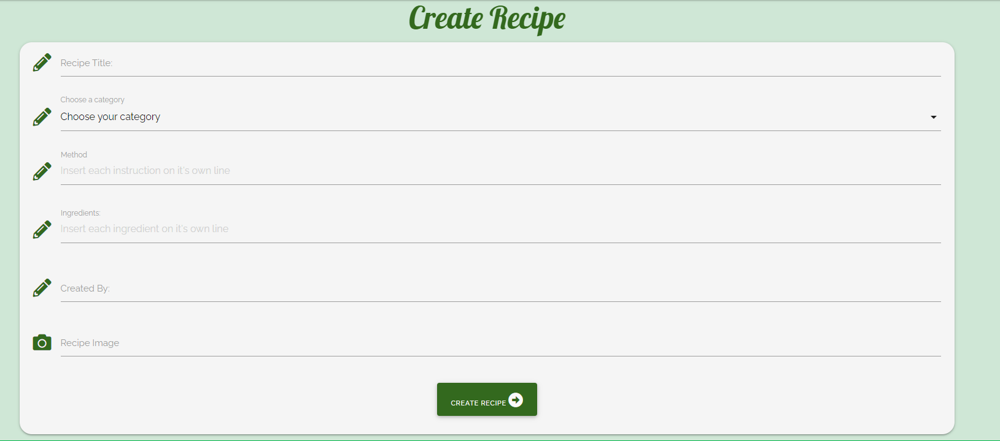

### User Story 2

  As a website user, I want the app to be easy to use.  I would expect to be able to register and for my details to be secure and safe.

I have used MongoDB to store all data.  

I have also used werkzeug.security for hashing passwords to enhance security.

### What do I expect to find on a web application?

1. Can I view all recipes?

All users can view all recipes on the home page.

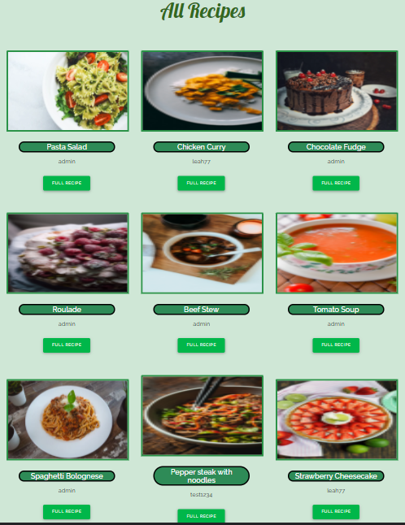

2. Can I create my recipes?

You can create your recipes.  Log in once you have registered and click on the create recipe page.

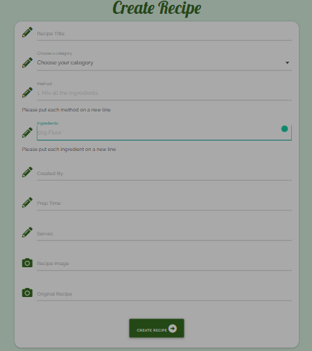

Fill out the form and add a link to the original recipe and an image if you wish.

Click on create recipe, and your recipe will be added to the database.

3. Can I edit or delete my recipes?

If you wish to edit a recipe at any stage, you can do so by going into your profile page and 
selecting the recipe, you want to edit.

Once you click to edit your recipe, it will be saved.

A flash message will appear to tell you; you have successfully edited your recipe.

You can also delete your recipe by clicking on the delete button on your profile page.


### User Story 3


### Would this website be suitable for younger family members?

This website is designed for the whole family to use.

I want this recipe to encourage families to share recipes.

1. Is the website suitable for all family members?

The website is suitable for all family members.
Younger members may find some recipes too complicated but can still enjoy looking through the pages.

2. Is it easy to navigate?

The website is easy to navigate, with simple links and buttons throughout the website.

3. What age is the app intended for?

This website is intended for families of all ages wishing to share recipes.
  
As a user, I would like to add my recipes and notes for viewing.

As a user, I would like to be able to edit my recipes and delete also.

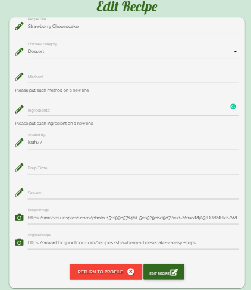


* You can do this by clicking on your profile page.
  
### User Story 4

### Would this app be suitable for sharing recipes?

This website is suitable for sharing recipes if you wish them to be shared.  


1. Is the app easy to navigate?

The website is easy to navigate with buttons and links throughout the pages.

2. Are there educational advantages to this app?

This website provides many educational links. We are providing opportunities to learn new recipes.  

As a user, I would like to share my recipes with all family members and friends.

You can share all the recipes you add to the website.

## Debugging

## Edit Recipe

When updating a recipe, the image does not save.

```
<!-- Add url image link to recipe -->
        <div class="row">
            <div class="input-field col s12">
                <i class="fas fa-camera prefix light-green-text text-darken-4"></i>
                <input id="img_url" name="img_url" type="text" class="validate">
                <label for="img_url">Recipe Image</label>
            </div>
        </div>
```

### Fix
Incorrect id used for input.  Changed "img_url" to "recipe_img_url"

```
<div class="row">
            <div class="input-field col s12">
                <i class="fas fa-camera prefix light-green-text text-darken-4"></i>
                <input id="recipe_img_url" name="recipe_img_url" type="text" class="validate">
                <label for="recipe_img_url">Recipe Image</label>
            </div>
        </div>

```

## Error: Original Recipe link not working

"recipe_url": request.form.get("recipe_img"),

### Fix 

The incorrect argument is given.


## Error: Attribute type not allowed on element select at this point.

From line 73, column 17; to line 74, column 58

          <select id="category_name" name="category_name" ↩                    type="text" class="validate" required>↩  

### Fix

Removed type="text" from select id.


## Error: Attribute minlength is only allowed when the input type is email, password, search, tel, text, or URL.

From line 121, column 17; to line 121, column 125

          <input id="prep_time" name="prep_time" minlength ="5" maxlength="50" type="number" class="validate" required>↩   

### Fix

Removed minlenght from input id.

## Error: Duplicate ID created_by.

From line 130, column 17; to line 130, column 127

          <input id="created_by" name="created_by" minlength ="5" maxlength="50" type="number" class="validate" required>↩    

### Fix

Changed input id to "serves"


## Error: An img element must have an alt attribute, except under certain conditions. 
From line 72, column 21; to line 72, column 60

          ↩ 

### Fix

Add an alt attribute to the image

## Profile page

I had difficulty with trying to get the images to align on the page.

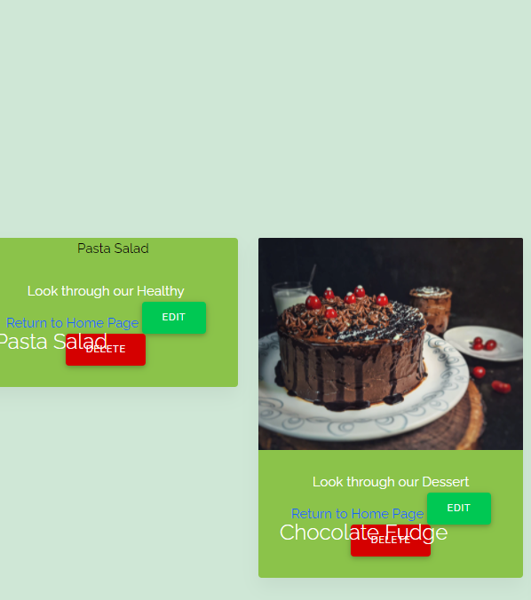

I fixed this error with some CSS styling.

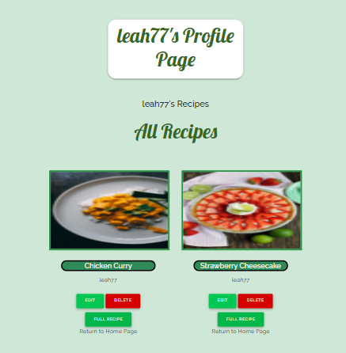


## Registration page

I had difficulty with the margins for the registration page when I was making it responsive.

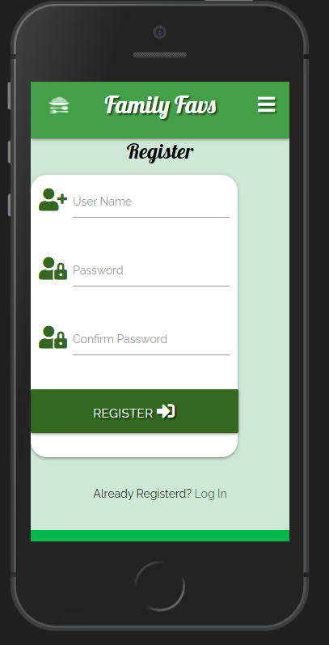

I solved this issue with a media query and some CSS styling on the class.

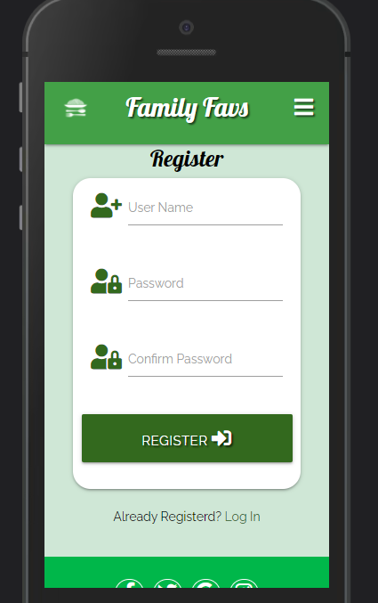

## Favicon issue

My favicon issue was not displaying.  After following the same guidelines from my previous project, I ended up contacting tutor support.
They were very helpful in explaining that the type attribute was not required this time.

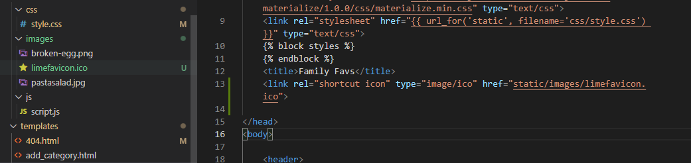

Once I removed this, the favicon loaded as expected.

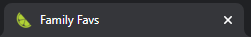

## Hero image too small

My hero image would not take up the entire width of the screen.

This was due to adding a container to the base.html.
The container was set to a max of 80%, so it would not allow the image to fill the screen.


I corrected this by removing the container from the base.html.

I then edited the CSS for the hero image to take up the correct amount of space.

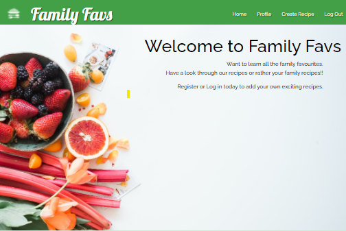

## Icons not displaying

My icons were not displaying. 

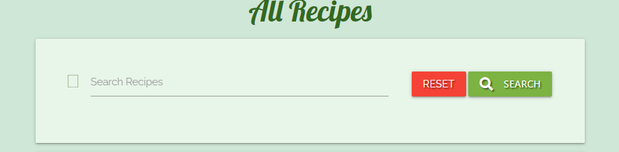

This was due to an update for the icons. Once I matched the correct link in my base.html.  The icons loaded.

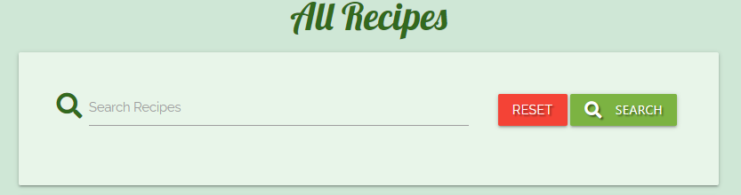

## Modal Error

Tried to include the following for a modal.

Unfortunately it kept shutting down the server and I was unable to complete it.
Code to use for modal.

```
<!-- Modal Structure -->
<div id="#delete-{{recipe._id}}" class="modal">
  <div class="modal-content">
    <h4>Are you sure you want to delete your recipe?</h4>
    <p>Thanks for sharing your recipe with us.</p>
  </div>
  <div class="modal-footer">
    <a href="{{ url_for('delete_recipe', recipe_id=recipe._id) }}" class="modal-close waves-effect waves-green btn-flat">Confirm Delete</a>
  </div>
</div>

```

```
<a href="#delete-{{recipe._id}}" class="btn red accent-4 modal-trigger">Delete</a><br>   

```

After discussing with tutor support.  I have a better understanding that materialize and mdbootstrap might override each other.
I will study this more and hopefully it will be issue I can resolve.

I have left the modal for now, and will continue to work on my understanding as to why it wouldn't show.

## Nav bar Error

My navbar items were being cut off at the sides in the full-screen view.

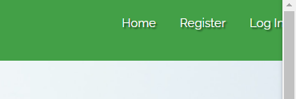

I changed the sizing, and this fixed the error.


## Social Links Alignment Error

I had difficulty in getting my social links to display in a line.
This error was fixed by spending more time understanding Materialize and MDBootstrap.
As it was my first time using these, I forgot to take into consideration the built-in classes.

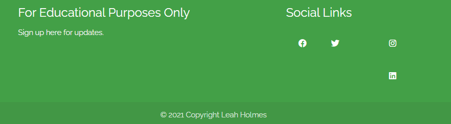

I decided to start again and had better luck with the second attempt(actually lots of trial and error).

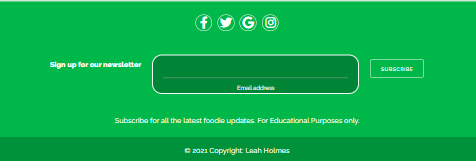


## End of Testing Section

[Return to Table of Contents](#table-of-contents)